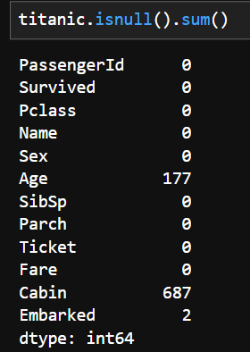
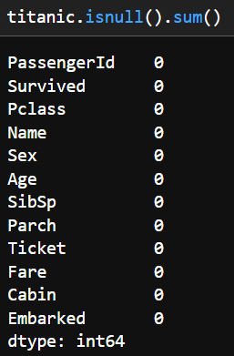

# 🧹 Data Cleaning & Preprocessing (Python)

## 📌 Project Overview

This project focuses on cleaning and preprocessing raw datasets using Python. The goal is to transform messy data into a structured format suitable for analysis.

---

## 🎯 Objectives

* Handle missing values
* Remove duplicate records
* Standardize data formats
* Prepare dataset for analysis

---

## 🛠 Tools & Technologies

* Python (Pandas, NumPy)
* Jupyter Notebook

---

## 🧹 Data Cleaning Steps

* Handled missing values using `dropna()` and `fillna()`
* Removed duplicate rows using `drop_duplicates()`
* Converted data types for consistency
* Standardized column names and formats

---

## 📊 Before vs After Cleaning

### Before Cleaning



### After Cleaning



---

## 📁 Project Structure

```text
Data-Cleaning-EDA-Python/
│
├── notebook/
│   └── data_cleaning.ipynb
├── data/
│   └── raw_data.csv
├── images/
│   └── cleaning1.png
│   └── cleaning2.png
├── README.md
```

---

## 🚀 Outcome

* Improved data quality and consistency
* Prepared dataset for further analysis
* Demonstrated strong data preprocessing skills

---

## 🔮 Future Improvements

* Automate cleaning pipeline
* Integrate with data visualization
* Apply on large datasets

---

## 👨‍💻 Author

**Irfan Shaik**
Aspiring Data Analyst
